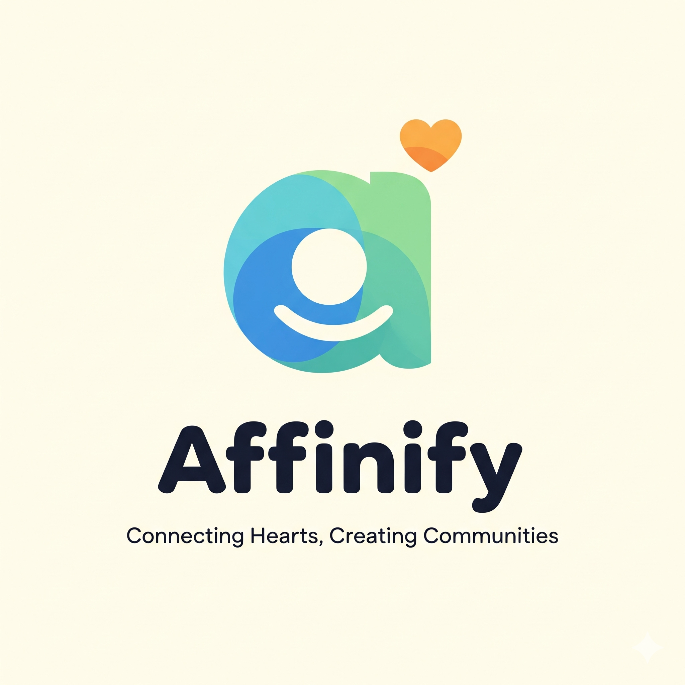

# 🎯 TestPath - Professional API Development Platform

<div align="center">
  
  
  **Professional API Development Ecosystem**
  
  [](LICENSE)
  [](https://github.com/hoppscotch/hoppscotch)
  [](STATUS_IMPLEMENTACAO.md)
</div>

---

## 📖 Início Rápido

### **Opção 1: Script Automático (Recomendado)**

```powershell
cd C:\App\Deployer\Project_Affinify\TestPath
.\start-testpath.ps1
```

### **Opção 2: Manual**

```powershell
# Terminal 1 - Backend
cd packages/hoppscotch-backend
pnpm run start:dev

# Terminal 2 - Frontend  
cd packages/hoppscotch-selfhost-web
pnpm run dev
```

### **URLs:**
- 🌐 Frontend: http://localhost:3000
- ⚙️ Backend: http://localhost:3170
- 🔌 GraphQL: http://localhost:3170/graphql

---

## ✨ Funcionalidades

### **API Testing:**
- ✅ REST API requests
- ✅ GraphQL queries & mutations
- ✅ WebSocket connections
- ✅ Server-Sent Events
- ✅ Socket.IO
- ✅ MQTT

### **Colaboração:**
- ✅ Team workspaces
- ✅ Shared collections
- ✅ Real-time sync
- ✅ Role-based access

### **Ferramentas:**
- ✅ Request collections
- ✅ Environment variables
- ✅ Pre/Post-request scripts
- ✅ Test scripts
- ✅ Code generation (10+ languages)

### **🆕 Exclusivo TestPath:**
- ✅ **Integração com Ecossistema Affinify**
- ✅ **SSO com Prodify**
- ✅ **Acesso unificado a todos os apps**
- ✅ **Branding personalizado**

---

## 🔐 Autenticação

### **SSO via Prodify:**

TestPath está integrado com o ecossistema Affinify. Usuários autenticados no Prodify podem acessar o TestPath automaticamente via SSO.

**Fluxo:**
1. Login no Prodify
2. Clicar em "Ecossistema" → "TestPath"
3. TestPath abre automaticamente autenticado

---

## 🎨 Ecossistema Affinify

TestPath faz parte do ecossistema Affinify. Clique no ícone de ecossistema (Grid 3x3) no header para acessar:

- **Prodify** - Task Management
- **OnScope** - Visual Web Editor
- **JazzUp** - Collaborative Canvas
- **DeepQuest** - AI Search
- **OpenUIX** - AI Interface

---

## 📦 Pré-requisitos

- Node.js v20+
- pnpm v10.15.0
- Docker Desktop
- PostgreSQL (via Docker)

---

## 🚀 Instalação

```powershell
# 1. Clonar repositório
git clone [seu-repo]

# 2. Instalar dependências
pnpm install

# 3. Configurar ambiente
cp .env.example .env
# Editar .env com suas configurações

# 4. Iniciar banco de dados
docker-compose -f ../docker-compose.fase1.yml up -d testpath-db

# 5. Rodar migrações
cd packages/hoppscotch-backend
npx prisma migrate deploy

# 6. Iniciar aplicação
cd ../..
.\start-testpath.ps1
```

---

## 📚 Documentação

### **Para Usuários:**
- **`LEIA-PRIMEIRO.md`** - Guia rápido de início
- **`PRIORIDADE.md`** - Como rodar e usar

### **Para Desenvolvedores:**
- **`IMPLEMENTACAO_FINAL.md`** - Detalhes técnicos
- **`INTEGRACAO_PRODIFY.md`** - Integração SSO
- **`REBRAND_TESTPATH.md`** - Branding

### **Para Negócios:**
- **`COMERCIALIZACAO.md`** - Plano de comercialização
- **`RESUMO_EXECUTIVO.md`** - Visão executiva

---

## ⚖️ Licença

TestPath é baseado em [Hoppscotch](https://github.com/hoppscotch/hoppscotch), licenciado sob MIT License.

**Copyright (c) 2022 Hoppscotch**  
**Copyright (c) 2025 TestPath (modificações e marca)**

Ver `THIRD_PARTY_LICENSES.md` para licenças completas.

**Você pode:**
- ✅ Usar comercialmente
- ✅ Modificar o código
- ✅ Distribuir

**Você deve:**
- ⚠️ Manter créditos ao Hoppscotch
- ⚠️ Incluir MIT License original

---

## 🤝 Contribuindo

TestPath é um projeto comercial baseado em Hoppscotch (MIT License).

Para contribuir com o projeto original:
- https://github.com/hoppscotch/hoppscotch

---

## 📞 Suporte

- **Documentação:** Ver arquivos `.md` na raiz do projeto
- **Issues:** [Configure seu sistema de issues]
- **Email:** [Configure seu email de suporte]

---

## 🙏 Agradecimentos

**TestPath é possível graças a:**
- [Hoppscotch](https://github.com/hoppscotch/hoppscotch) - Projeto base (MIT License)
- Toda a comunidade open source
- Ecossistema Affinify

---

<div align="center">
  
**Built with ❤️ by TestPath**

Powered by Affinify Ecosystem

</div>

